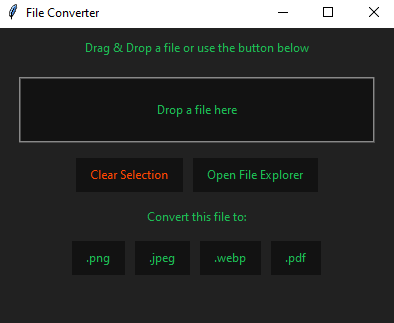

# 📄 File Converter

## 📌 Description
The **File Converter** is a graphical user interface (GUI) application that allows converting **JPEG, PDF, PNG, WEBP** files. It supports drag-and-drop functionality and file selection via the file explorer.

## 🎨 Features
- ✅ **Convert JPEG, PDF, PNG, WEBP**
- ✅ **Drag & Drop support** – simply drag files into the application
- ✅ **File selection through file explorer**
- ✅ **Custom app icon** for shortcut

## 🔧 Requirements
- **Python 3.13 or later**
- **Dependencies should download automatically**
- **If needed install dependencies manually:**
  ```sh
  pip install -r apprequirements.txt
  ```

## 🚀 Running the Application in console
1. Download the **converterapp-V3.py** file.
2. **Run the script**:
   ```sh
   python converterapp-V3.py
   ```
3. **Alternatively:** Download and use the **BAT** file to run the application without opening the console.

## 📷 Example UI



## 🛠️ Author
**jjhk-coag / Jakub Karczewski**


